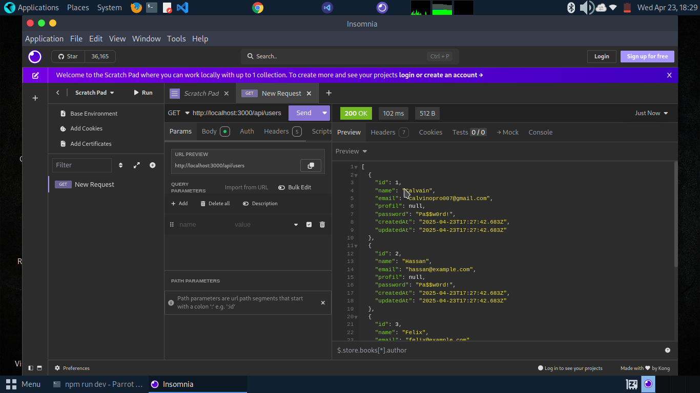

# MonPremierLab - Création d'une API REST avec Node.js et Express : Solution

Ceci est une solution à l'atelier [Création d'une API REST avec Node.js et Express de MonPremierLab](https://github.com/DOUMBAJC/mon-premier-lab-manage-stock).

## Table des matières

- [MonPremierLab - Création d'une API REST avec Node.js et Express : Solution](#monpremierlab---création-dune-api-rest-avec-nodejs-et-express--solution)
  - [Table des matières](#table-des-matières)
  - [Aperçu](#aperçu)
    - [Le challenge](#le-challenge)
    - [Capture d'écran](#capture-décran)
    - [Liens](#liens)
  - [Mon processus](#mon-processus)
    - [Construit avec](#construit-avec)
    - [Ce que j'ai appris](#ce-que-jai-appris)
    - [Développement futur](#développement-futur)
    - [Ressources utiles](#ressources-utiles)
  - [Auteur](#auteur)
  - [Remerciements](#remerciements)

---

## Aperçu

### Le challenge

L'objectif de l'atelier était de créer une API REST fonctionnelle en utilisant Node.js et Express. Je devais implémenter des endpoints pour gérer des ressources comme les utilisateurs et les produits, en respectant les principes REST et en structurant l'application de manière modulaire pour faciliter son évolution.

Les principales fonctionnalités à implémenter étaient :

- Des endpoints CRUD complets (Create, Read, Update, Delete) pour au moins deux ressources
- Des URLs claires et significatives
- Une utilisation appropriée des méthodes HTTP (GET, POST, PUT, DELETE)
- Une architecture modulaire et extensible

### Capture d'écran



Cette capture d'écran montre un test de l'API avec Postman, où j'envoie une requête GET à l'endpoint `/api/users` et reçois la liste des utilisateurs en format JSON.

### Liens

- Solution URL : [GitHub](https://github.com/DOUMBAJC/mon-premier-lab-manage-stock)

---

## Mon processus

### Construit avec

- Node.js
- Express.js
- JavaScript ES6
- Postman (pour tester l'API)
- Architecture MVC (Model-View-Controller)
- Nodemon (pour le rechargement automatique pendant le développement)

### Ce que j'ai appris

Ce projet m'a permis d'acquérir plusieurs compétences clés dans le développement d'APIs REST :

- Comment structurer une application Express de manière modulaire avec des controllers et des services
- L'importance de séparer la logique métier des routes et des contrôleurs
- Comment implémenter correctement les opérations CRUD en suivant les conventions REST
- La gestion des erreurs et des réponses appropriées selon les statuts HTTP

Un exemple de code dont je suis particulièrement fier est la structure du contrôleur d'utilisateurs qui suit une approche clean et modulaire :

```javascript
const getUserById = (req, res) => {
  const id = parseInt(req.params.id);
  const user = userService.getUserById(id);
  
  if (!user) {
    return res.status(404).json({ message: "Utilisateur non trouvé" });
  }
  
  res.json(user);
};
```

### Développement futur

Pour améliorer ce projet à l'avenir, j'aimerais :

- Ajouter une base de données MongoDB ou PostgreSQL pour remplacer le stockage en mémoire
- Implémenter l'authentification JWT pour sécuriser l'API
- Implémenter une validation des données plus robuste avec express-validator

### Ressources utiles

- [Documentation Express.js](https://expressjs.com/fr/) - Cette ressource a été essentielle pour comprendre comment structurer l'application et utiliser les fonctionnalités d'Express.
- [REST API Design Best Practices](https://blog.restcase.com/) - Un excellent article qui m'a aidé à comprendre les meilleures pratiques pour la conception d'APIs REST.

---

## Auteur

- GitHub - [@DOUMBAJC](https://github.com/DOUMBAJC)
- LinkedIn - [@DOUMBA J C](https://www.linkedin.com/in/doumba-j-c-18a915329/)

---

## Remerciements

Je tiens à remercier l'équipe de MonPremierLab pour avoir créé cet atelier instructif et bien structuré. Les instructions claires et la documentation fournie ont été précieuses pour la réalisation de ce projet.
